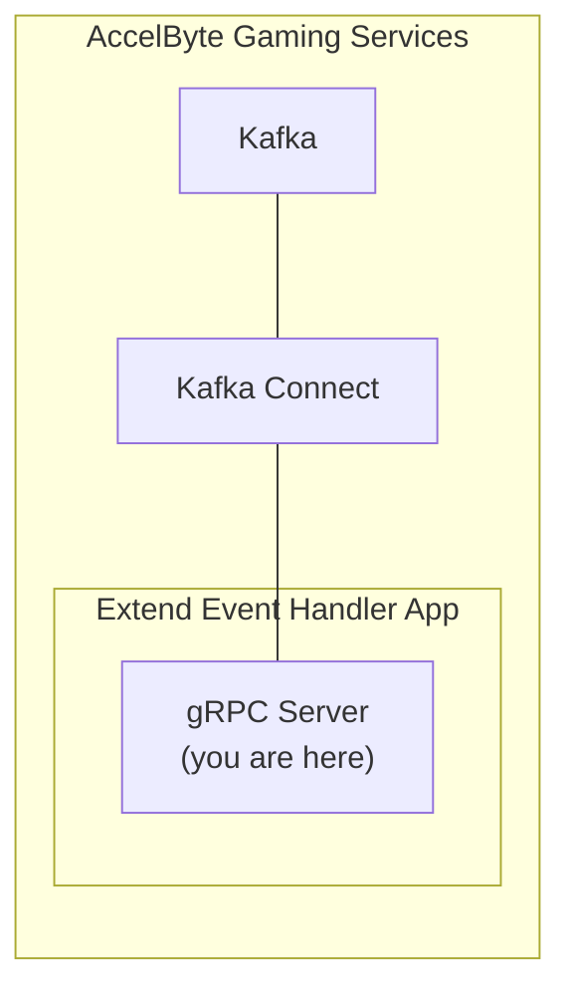

# extend-event-handler-python 



`AccelByte Gaming Services` (AGS) capabilities can be enhanced using 
`Extend Event Handler` apps. An `Extend Event Handler` app is a gRPC server that 
receives AGS events through `Kafka Connect` and performs actions based on 
custom logic.

## Overview

This repository provides a project template for an `Extend Event Handler` 
app written in `Python`. It includes an example to handle AGS `userLoggedIn` event 
and grant an item to the user. Additionally, it comes with built-in 
instrumentation for observability, ensuring that metrics, traces, and logs are 
available upon deployment.

You can clone this repository to begin developing your own `Extend Event Handler`
app. Simply modify this project by including the AGS event spec files
you need and implement custom logic to handle those events.

## Project Structure

Here are some important folders you need to know to be able to start modifying
this project.

```text
...
├── src
│  └── app
│    ├── proto                   # AGS event spec files (*.proto) and code generated from them
│    └── services
│      ├── __init__.py
│      └── login_handler.py      # Logic to handle AGS event is implemented here
...
```

> :exclamation: In the example included in this project, we focus solely on the
`userLoggedIn` event. Therefore, only the AGS event spec files 
for IAM are included. For other events, the AGS event spec files are available
[here](https://github.com/AccelByte/accelbyte-api-proto/tree/main/asyncapi/accelbyte). 

## Prerequisites

Before starting, you will need the following.

1. Windows 11 WSL2 or Linux Ubuntu 22.04 or macOS 14+ with the following tools installed:

   a. Bash

      - On Windows WSL2 or Linux Ubuntu:

         ```
         bash --version

         GNU bash, version 5.1.16(1)-release (x86_64-pc-linux-gnu)
         ...
         ```

      - On macOS:

         ```
         bash --version

         GNU bash, version 3.2.57(1)-release (arm64-apple-darwin23)
         ...
         ```

   b. Make

      - On Windows WSL2 or Linux Ubuntu:

         To install from the Ubuntu repository, run `sudo apt update && sudo apt install make`.

         ```
         make --version

         GNU Make 4.3
         ...
         ```

      - On macOS:

         ```
         make --version

         GNU Make 3.81
         ...
         ```

   c. Docker (Docker Desktop 4.30+/Docker Engine v23.0+)
   
      - On Linux Ubuntu:

         1. To install from the Ubuntu repository, run `sudo apt update && sudo apt install docker.io docker-buildx docker-compose-v2`.
         2. Add your user to the `docker` group: `sudo usermod -aG docker $USER`.
         3. Log out and log back in to allow the changes to take effect.

      - On Windows or macOS:

         Follow Docker's documentation on installing the Docker Desktop on [Windows](https://docs.docker.com/desktop/install/windows-install/) or [macOS](https://docs.docker.com/desktop/install/mac-install/).

         ```
         docker version

         ...
         Server: Docker Desktop
            Engine:
            Version:          24.0.5
         ...
         ```

   d. Python 3.10

      - On Linux Ubuntu:

         To install from the Ubuntu repository, run `sudo apt update && sudo apt install python3 python3-venv`.

      - On Windows or macOS:

         Use the available installer [here](https://www.python.org/downloads/).

         ```
         python3 --version

         Python 3.10.12
         ```

   e. [grpcui](https://github.com/fullstorydev/grpcui)

      - Use the available binary from [grpcui](https://github.com/fullstorydev/grpcui/releases).

      ```
      grpcui --version

      grpcui v1.4.1
      ```

   f. [extend-helper-cli](https://github.com/AccelByte/extend-helper-cli)

      - Use the available binary from [extend-helper-cli](https://github.com/AccelByte/extend-helper-cli/releases).

   > :exclamation: In macOS, you may use [Homebrew](https://brew.sh/) to easily install some of the tools above.

2. Access to `AccelByte Gaming Services` environment.

   a. Base URL:

      - For `Starter` tier e.g.  https://spaceshooter.prod.gamingservices.accelbyte.io
      - For `Premium` tier e.g.  https://dev.accelbyte.io

   b. [Create a Game Namespace](https://docs.accelbyte.io/gaming-services/tutorials/how-to/create-a-game-namespace/) if you don't have one yet. Keep the `Namespace ID`.


   c. [Create an OAuth Client](https://docs.accelbyte.io/gaming-services/services/access/authorization/manage-access-control-for-applications/#create-an-iam-client) with confidential client type with the following permissions. Keep the `Client ID` and `Client Secret`.
   
   - For AGS Premium customers:
      - `ADMIN:NAMESPACE:{namespace}:USER:*:FULFILLMENT [CREATE]`
   - For AGS Starter customers:
      - Platform Store -> Fulfillment (Create)

3. A published `AGS` Store. Take a note of the `item id` which is to be granted after a user in a certain namespace successfully logged in.

## Setup

To be able to run this app, you will need to follow these setup steps.

1. Create a docker compose `.env` file by copying the content of 
   [.env.template](.env.template) file.

   > :warning: **The host OS environment variables have higher precedence 
   compared to `.env` file variables**: If the variables in `.env` file do not 
   seem to take effect properly, check if there are host OS environment 
   variables with the same name.  See documentation about 
   [docker compose environment variables precedence](https://docs.docker.com/compose/environment-variables/envvars-precedence/) 
   for more details.

2. Fill in the required environment variables in `.env` file as shown below.

   ```
   AB_BASE_URL=https://demo.accelbyte.io     # Base URL of AccelByte Gaming Services demo environment
   AB_CLIENT_ID='xxxxxxxxxx'                 # Client ID from the Prerequisites section
   AB_CLIENT_SECRET='xxxxxxxxxx'             # Client Secret from the Prerequisites section
   AB_NAMESPACE='xxxxxxxxxx'                 # Namespace ID from the Prerequisites section
   ITEM_ID_TO_GRANT='xxxxxxxxxx'             # Item id from a published store we noted previously
   ```

## Building

To build this app, use the following command.

```
make build
```

## Running

To (build and) run this app in a container, use the following command.

```
docker compose up --build
```

## Testing

### Test in Local Development Environment

This app can be tested locally using [grpcui](https://github.com/fullstorydev/grpcui).

1. Run this app by using the command below.

   ```shell
   docker compose up --build
   ```

2. Run `grpcui` with the following command.

   ```shell
   grpcui -plaintext localhost:6565
   ```

   > :warning: **If you are running [grpc-plugin-dependencies](https://github.com/AccelByte/grpc-plugin-dependencies) stack alongside this project as mentioned in [Test Observability](#test-observability)**: Use `localhost:10000` instead of `localhost:6565`. This way, the `gRPC server` will be called via `Envoy` service within `grpc-plugin-dependencies` stack instead of directly.

3. Now in `grpcui`, send a sample of kafka event you are interested in. In this 
   case, we are interested in `userLoggedIn` event. So, we are using sample payload 
   [here](https://docs.accelbyte.io/gaming-services/developers/api-events/iam-account/#message-userloggedin).


   ```json
   {
     "payload": {
        "userAccount": {
           "userId": "string",
           "emailAddress": "string",
           "country": "string",
           "namespace": "string"
        },
        "userAuthentication": {
           "platformId": "string",
           "refresh": true
        }
     },
     "id": "string",
     "version": 0,
     "name": "string",
     "namespace": "string",
     "parentNamespace": "string",
     "timestamp": "2019-08-24T14:15:22Z",
     "clientId": "string",
     "userId": "string",
     "traceId": "string",
     "sessionId": "string"
   }
   ```

   > :exclamation: You can change the field value you are interested in to suits 
   your need, e.g. `namespace` , `userId`, etc

   Finally, make sure to select the right service name and method name
   and click `Invoke` to send the request.

   


   > :exclamation: **If you are interested on other events:** you can find it 
   [here](https://docs.accelbyte.io/gaming-services/developers/api-events/achievement/).

 
4. If successful, you will see in the response as follows and you can also see 
   the item granted to the user you are using for this test.
   
    

   

### Test Observability

To be able to see the how the observability works in this app locally, there are few things that need be setup before performing tests.

1. Uncomment loki logging driver in [docker-compose.yaml](docker-compose.yaml)

   ```
    # logging:
    #   driver: loki
    #   options:
    #     loki-url: http://host.docker.internal:3100/loki/api/v1/push
    #     mode: non-blocking
    #     max-buffer-size: 4m
    #     loki-retries: "3"
   ```

   > :warning: **Make sure to install docker loki plugin beforehand**: Otherwise,
   this project will not be able to run. This is required so that container logs
   can flow to the `loki` service within `grpc-plugin-dependencies` stack. 
   Use this command to install docker loki plugin: `docker plugin install grafana/loki-docker-driver:latest --alias loki --grant-all-permissions`.

2. Clone and run [grpc-plugin-dependencies](https://github.com/AccelByte/grpc-plugin-dependencies) stack alongside this project. After this, Grafana 
will be accessible at http://localhost:3000.

   ```
   git clone https://github.com/AccelByte/grpc-plugin-dependencies.git
   cd grpc-plugin-dependencies
   docker compose up
   ```

   > :exclamation: More information about [grpc-plugin-dependencies](https://github.com/AccelByte/grpc-plugin-dependencies) is available [here](https://github.com/AccelByte/grpc-plugin-dependencies/blob/main/README.md).

3. Perform testing. For example, by following [Test in Local Development Environment](#test-in-local-development-environment).

## Deploying

To deploy this app to AGS, follow the steps below.

1. [Create a new Extend Event Handler app on Admin Portal](https://docs.accelbyte.io/gaming-services/services/extend/event-handler/). Keep the `Repository URI`.

2. Download and setup [extend-helper-cli](https://github.com/AccelByte/extend-helper-cli/)   (only if it has not been done previously).

3. Perform docker login with `extend-helper-cli` using the following command.
   ```
   extend-helper-cli dockerlogin --namespace <my-game> --app <my-app> --login
   ```
   > :exclamation: For your convenience, the above `extend-helper-cli` command 
   can also be copied from `Repository Authentication Command` under the 
   corresponding app detail page.

4. Build and push this project docker image to AccelByte ECR using the following command.
   
   ```
   extend-helper-cli image-upload --work-dir <my-project-dir> --namespace <my-game> --app <my-app> --image-tag v0.0.1
   ```

   > :warning: Make sure to perform docker login (step 3) before executing the above command.

5. Open Admin Portal, go to **Extend** -> **Event Handler**. And then select 
   the extend app.

6. To deploy selected image tag, click **Image Version History** and select 
   desired image tag to be deployed.

7. Click **Deploy Image**, confirm the deployment and go back to App Detail by 
   clicking **Cancel**.

8. Wait until app status is running.

For more information on how to deploy an `Extend Event Handler` app, see 
[here](https://docs.accelbyte.io/gaming-services/services/extend/event-handler/getting-started-event-handler/#deploy-in-ags).

## Next Step

Proceed create your own `Extend Event Handler` app by modifying this project. 
See [here](https://docs.accelbyte.io/gaming-services/services/extend/event-handler/how-to-listen-and-handle-different-ags-events/) for more details.
